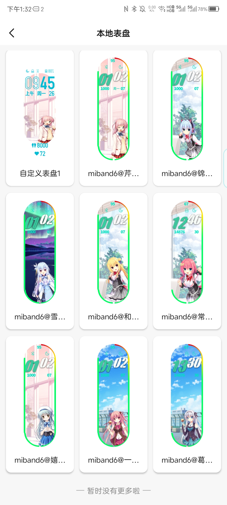

# MiBand6_WatchFace

---

小米手环6自制表盘

**请注意：本仓库的表盘仅使用于小米手环6（及其 NFC 版），请不要用于其它型号手环**

[静态图](/静态图) 文件夹下是适用于官方“自定义表盘”的图

[表盘主题](/表盘主题) 文件夹下是本人自制表盘，需要复制到指定目录使用 Zepp Life APP 导入

具体使用方法请看各文件夹下 Readme

## todo

- [x] 芹泽水结 [静态图](/静态图/miband6@芹泽水结.png) | [表盘主题](/表盘主题/miband6@芹泽水结_ver1.0)
- [x] 锦亚澄 [静态图](/静态图/miband6@锦亚澄.png) | [表盘主题](/表盘主题/miband6@锦亚澄_ver1.0)
- [x] 雪景式 [静态图](/静态图/miband6@雪景式.png) | [表盘主题](/表盘主题/miband6@雪景式_ver1.0)
- [x] 常磐华乃 [静态图](/静态图/miband6@常磐华乃.png) | [表盘主题](/表盘主题/miband6@常磐华乃_ver1.0)
- [x] 和泉妃爱 [静态图](/静态图/miband6@和泉妃爱.png) | [表盘主题](/表盘主题/miband6@和泉妃爱_ver1.0)
- [x] 嬉野纱弓实 [静态图](/静态图/miband6@嬉野纱弓实.png) | [表盘主题](/表盘主题/miband6@嬉野纱弓实_ver1.0)
- [x] 一条心爱 [静态图](/静态图/miband6@一条心爱.png) | [表盘主题](/表盘主题/miband6@一条心爱_ver1.0)
- [x] 葛城真冬 [静态图](/静态图/miband6@葛城真冬.png) | [表盘主题](/表盘主题/miband6@葛城真冬_ver1.0)
- [ ] All in One
- [ ] ……

## 快速预览

请见下图，因为渲染出了一点点问题，表盘实际效果请以图中左上角第二张的 `miband6@芹泽水结` 为准（这张我手动做了一下渲染），剩下的预览图看不到星期几但是实际同步到手环上可以正常显示，左上角第一张是本仓库静态图搭配APP内内置的“自定义表盘”的效果，预览也是有点拉伸异常但是手环上面的比例是正常的

具体大图请点击`todo`一节中的链接查看，推荐同步到手环上感受实际效果

